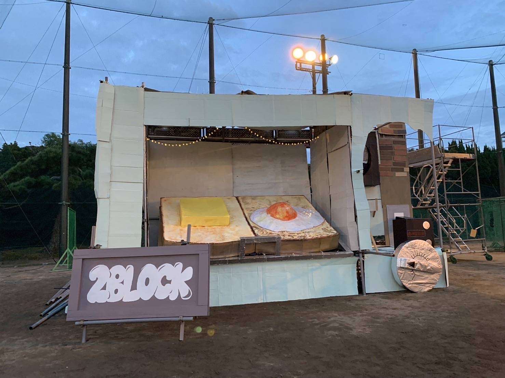

# 凸資料

令和3年度 2ブロ凸長 中村美童

---

## 目次

---
## 初めに

---

## これって誰に向けたもの？

ほとんどが凸長になりたい、凸長になった人に向けたものですが七長スピーチや学祭についても書いています。

---
## 凸長に求められるもの

具体的に
- 凸が大好きな人
- 1年2年で作業に参加した人
- 運営と仲良くできる人

凸長のタイプ
1. 技術がある人
絵がうまかったり美術的センスがある人
2. 喋れる人
人前で喋れたり指示できる人
---
## スピーチ

---
### 構成について

---
### 練習について

---
## 学祭

---
## やること

---
### 二年のうちにやること

---
### 三年になってからやること

---
#### 学祭のときにやること

---
#### 夏休み前にやること

---
#### 夏休みにやること

---
#### 作業期間中にやること

---
## 凸について

---
### チー凸について

---
### どんな凸をつくるか

---
### 企画について

---
### 企画書について

---
### 3Dについて
3Dを使ったほうが圧倒的にわかりやすいです

---
### 施策について

---
### 作業について