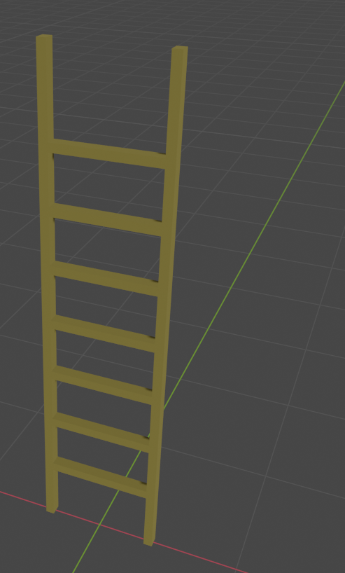
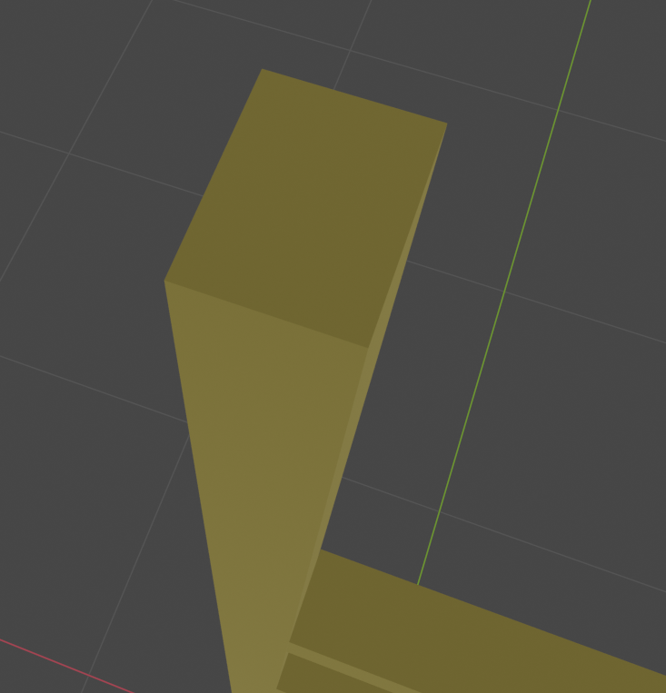

# はしご
## 完成イメージ

## 材料
- 杉角材(170cm * 3cm * 4cm)　2本
- 杉角材(35cm * 3cm * 4cm)　7本
- ネジ、釘(5cm以上のもの) 14本
- 紙粘土
- ボンド
- ペンキ

## 作り方
1. 角材を材料の大きさに切る
2. 塗装
3. 角材にネジ穴を開ける
4. 接合部分にボンドをつける
5. ネジで止める
6. 滑り止めとして梯子の下の足に紙粘土をつける