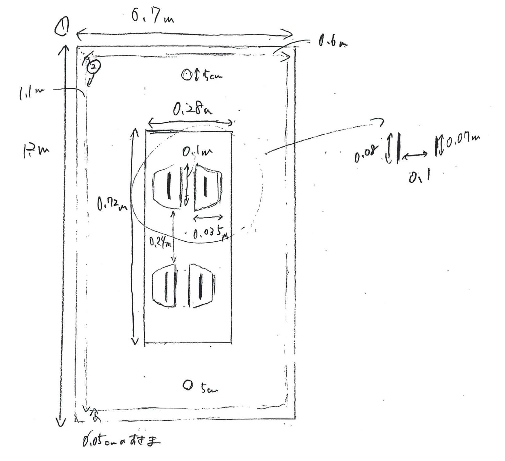

# コンセント
## 完成イメージ

## 材料
- ダンボール

- アルミホイル
- ペンキ(白、灰色)

## 作り方
### 灰色部分
1. 0.67 * 1.1mの大きさにダンボール１枚を切る
2. 0.6 * 1m の大きさに２枚ダンボールを切ってボンドで重ねる
3. (1)(2)を合わせる
4. 上からアルミホイルを貼る

### 白色部分
1. 0.72 * 0.28mでダンボールを２枚切る
2. (1)の一枚目のダンボールに図のように穴を開ける
3. (1)の両方のダンボールに図のような穴を開ける