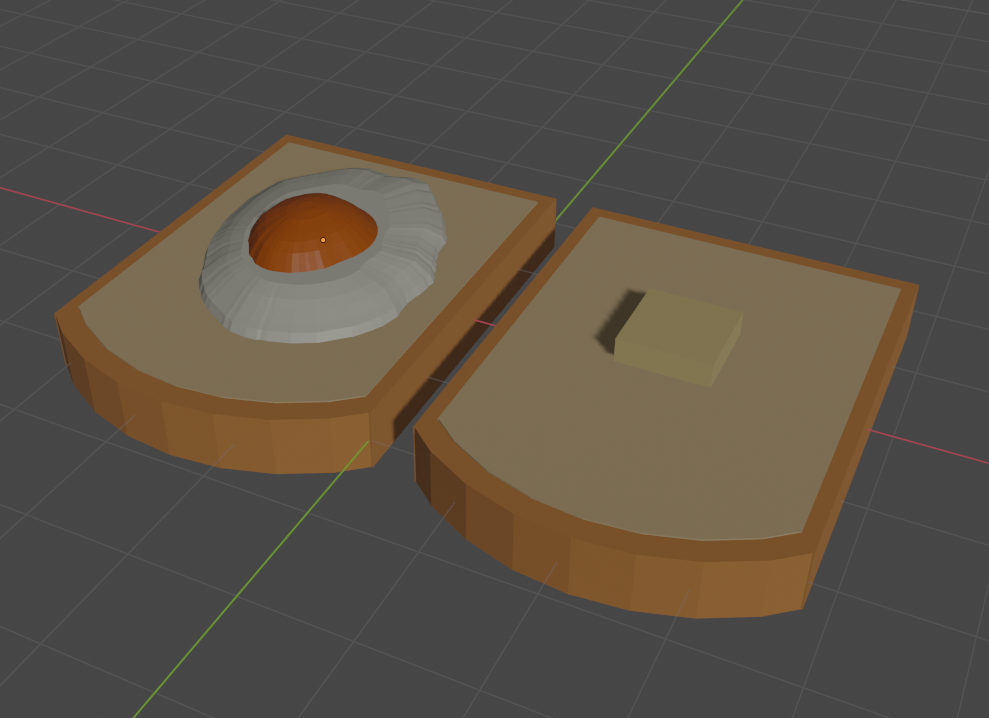
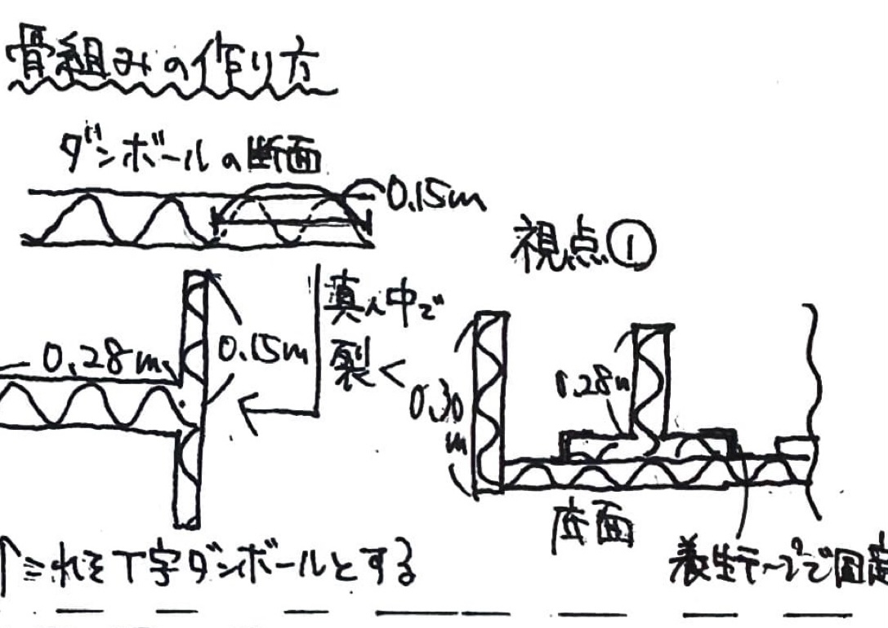
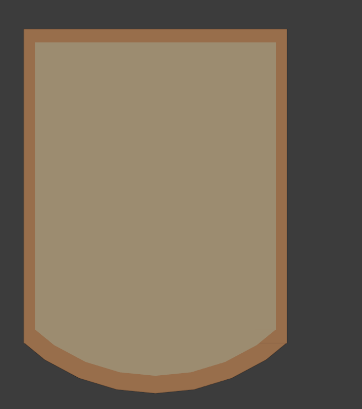
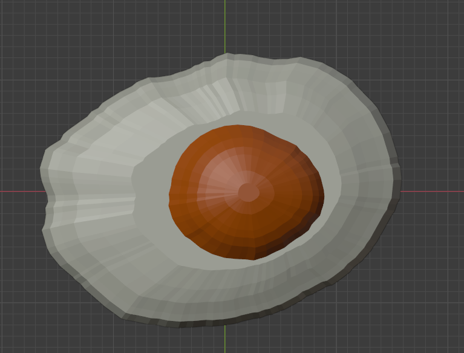
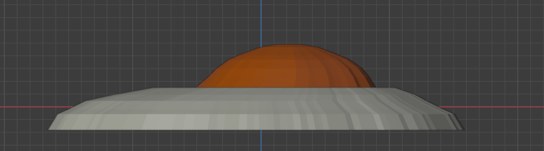
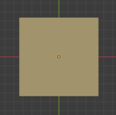
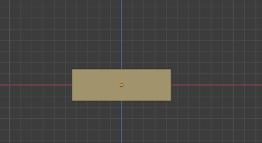

# 主食用パン(２枚)
## 完成イメージ

## 材料

# T字ダンボール説明(右に)

- ダンボール

| 名前 | 寸法 |数量|
| -| -| -| -|
|側面1 | 2.0m * 0.3m | 2 |
|側面2 | 1.675m * 0.3m | 1 |

- T字ダンボール

| 名前 | 寸法 |数量|
| -| -| -| -|
|T字ダンボール1 | 2.1m * 0.28m | 2 |
|T字ダンボール2 | 2.2m * 0.28m | 2 |

.

- 水性絵の具(黄土色、薄茶色、赤茶色)
- 紙粘土
- 養生テープ

### ハリボテ用
- 新聞紙
- ボンド
- 広告ボーン

## 構造

### 骨組み
# 骨組み画像上面図

## 作り方
1. 底面の大きさにダンボールをパッチワークする
2. ダンボール、T字ダンボールを上のように切り出す
3. ダンボールを組み合わせる
4. ハリボテする
5. 黄土色、薄茶色、赤茶色の絵の具をパンの耳用、表面用に混ぜる
6. ハリボテした表面に(6)の表面用紙粘土を1cmの厚さでボンドで貼る
7. 粘土を薄く伸ばして表面にパンの気泡を作る(歯ブラシなどで叩く、穴を開ける)
8. 側面のダンボールに(6)の耳用の紙粘土を2mmの暑さで貼る

### ダンボール枠組み

## 目玉焼き

### 材料
- ダンボール
- 広告ボーン
- 針金
- 新聞紙
- 紙粘土
- ペンキ
- ニス
- ボンド

1. 黄身のダンボールを切る
2. 半径20cmのダンボールの円に食パンと同じ要領で貼る
3. 上から黄土色のペンキで色を付けながら、ハリボテ
4. 半円球(黄身)の中央辺りに広告ボーンをつける
5. 白身のもとになる部分をダンボールで切る
6. (4)を基準に針金を白身になるように伸ばす
7. ハリボテをする
8. 食パンに載せ、全体にニスを塗る

## バター

### 材料
- ダンボール
- 広告ボーン
- ペンキ
- ボンド
- ニス

1. ダンボールで箱を作る(中をボーンで補強)
2. 黄色に塗る
3. ボンドで溶けた厚みを出す(ボンドの中にペンキを混ぜる)
4. ニスで溶けた表面を塗る