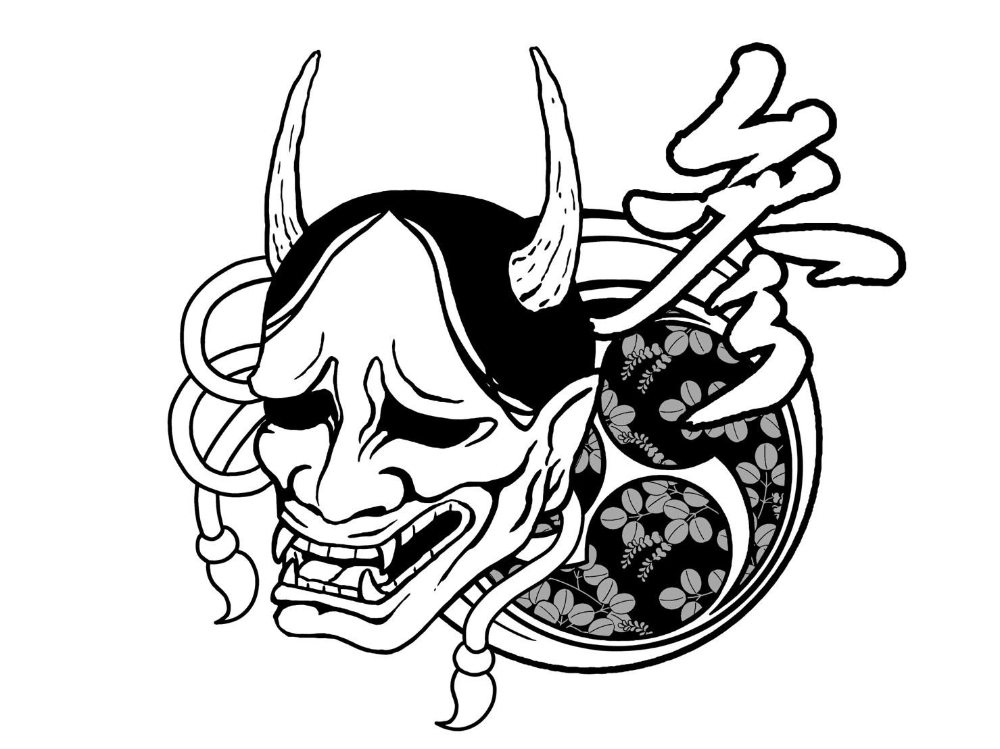

# バッテリー
## 完成イメージ

## パーツ
1. 箱
2. ステッカー
## 材料

## 作り方
1. ダンボール（柱用）を丸めて、養生テープで筒状にする。
2. 1とダンボール(箱内部)を養生テープを用いて重ねる。
3. 2の周りにダンボール(箱内部)を貼る。
4. 3の表面を黒色に塗装する
5. ダンボール(円)にアルミホイル(円)を貼り、４へボンドで貼り付ける
6. ダンボール(蓋)に穴を開け導線を入れてまだ貼っていない三辺を黒テープと養生テープで貼る。
