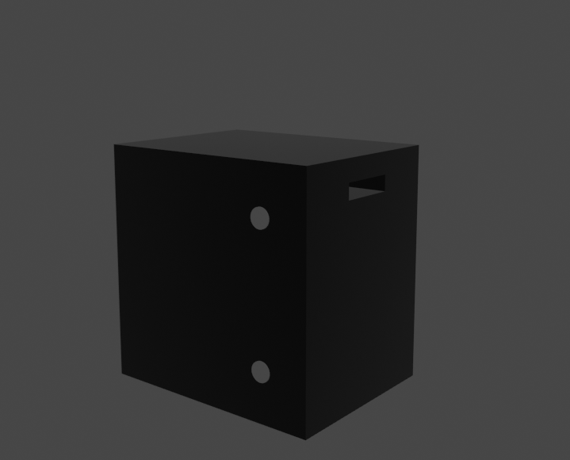

# バッテリー
## 完成イメージ

## パーツ
1. 箱
2. ステッカー

## 材料
| 名前 | 寸法 | 数量 | 
| -- | -- | -- |
|　ダンボール(面) |  66cm * 66cm | 2枚 | 
|　ダンボール(面) |  46cm * 66cm | 4枚 | 
|　ダンボール(柱用) |  25cm * 30cm | 2枚 | 
|　ダンボール(円)　 | 半径8cm | 2枚 | 
| アルミホイル(円) | 半径9cm | 2枚 |
| ペンキ(黒) |　 |　4.1m^2 |
| 黄色画用紙| 4cm * 25cm| 1|
| 黄色画用紙| 10cm * 50cm| 1|
| 黄色画用紙| 35cm * 50cm| 1|
| 養生 | | |
| クラフト | | |
| ボンド | | |
| ビニテ(黒)| | |

### 注意
- ダンボール(面)には上記の寸法にのりしろをつける

## 作り方
1. ダンボール(柱)を丸め、養生を貼って筒状にする
2. ダンボールを大きさに切る
3. ダンボールを図の容器切り出して黒色に塗装する
4. ダンボール(円)にアルミホイルを貼りボンドでつける
5. 画用紙に注意書きを加工する
6. 導線を入れる