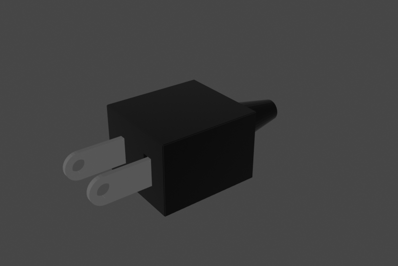
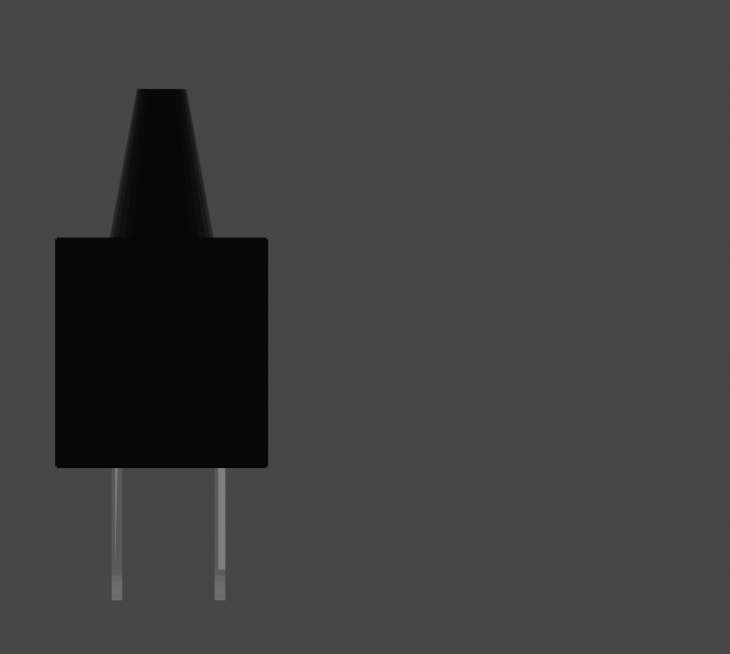
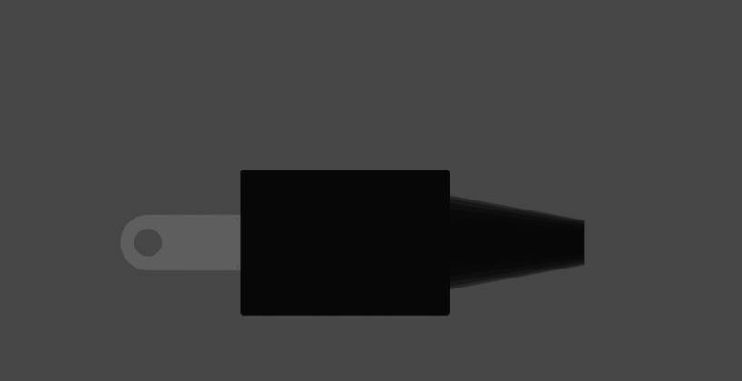

# プラグ
## 完成イメージ

図面

## 材料

## 作り方
３つの部分に分けて作る

### 1
1. ダンボールを切る
2. (コンセントの指す部分)を三枚ずつ重ねる
3. アルミホイルを貼る
4. 板を二枚重ねる
5. 黒のビニールテープを片面だけ貼る
6. コンセントの差し込む部分を板に差し込む
7. 裏側に突き出た部分に束ねたダンボールを指して固定

### 2
1. ダンボールを切る
2. はこのように組み立ててカラーテープで固定
3. 黒のビニールテープを巻く

### 3
1. ダンボールで部品を作る
2. 動線と同じようにコード(黒 10m)をつくる
3. (1)の片面にだけビニールテープを貼る
4. 円錐のダンボールの大きい方をダンボールで差込みテープで固定