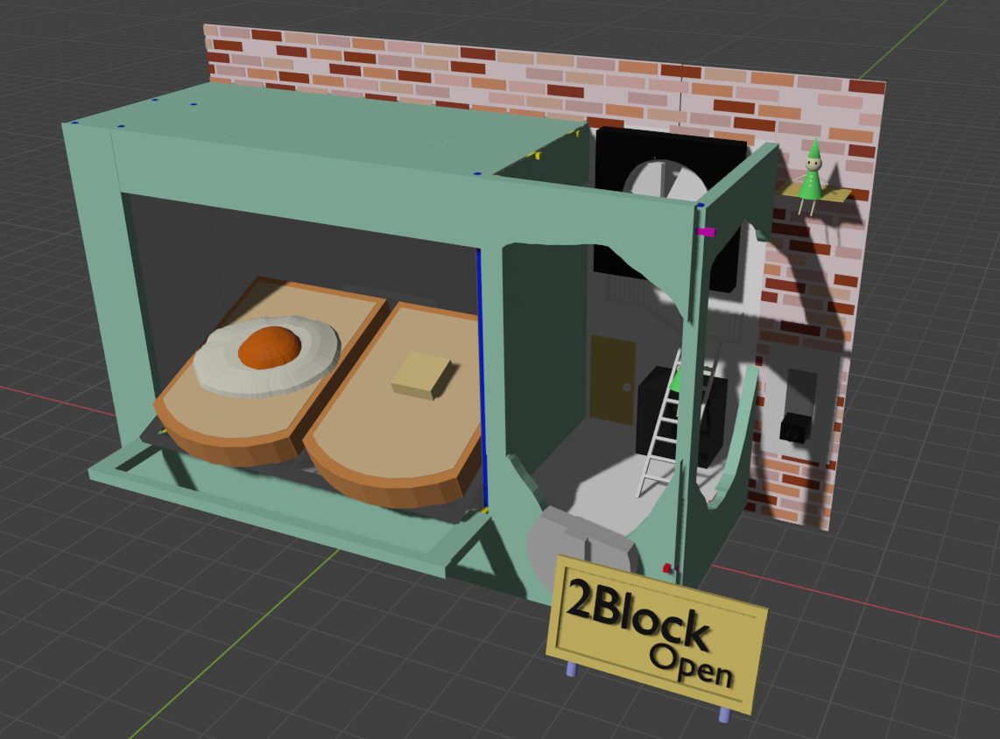
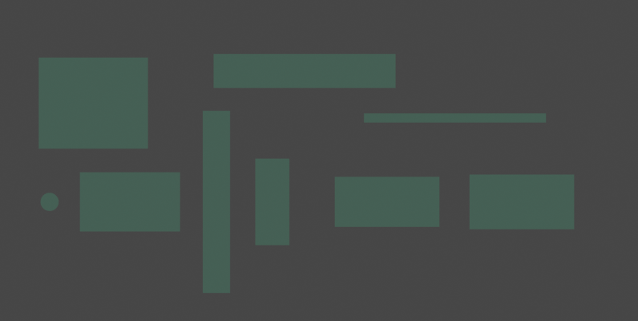
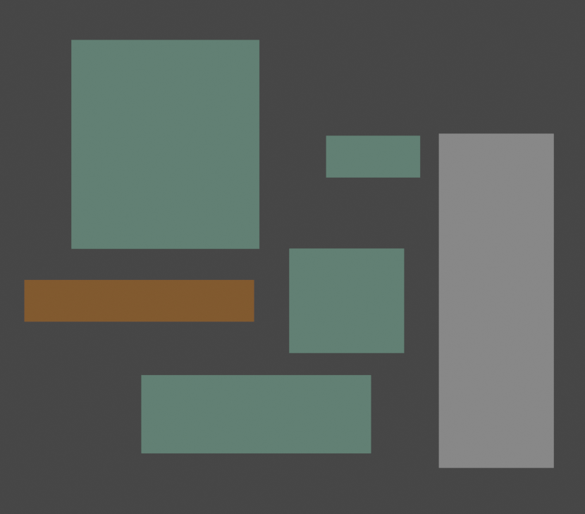
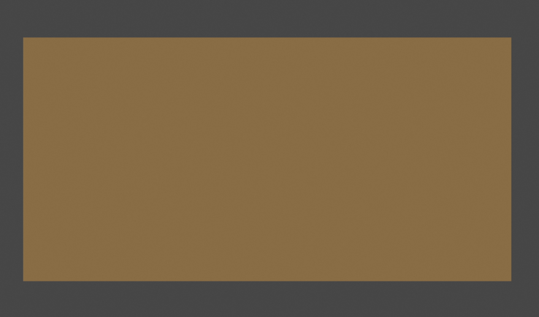
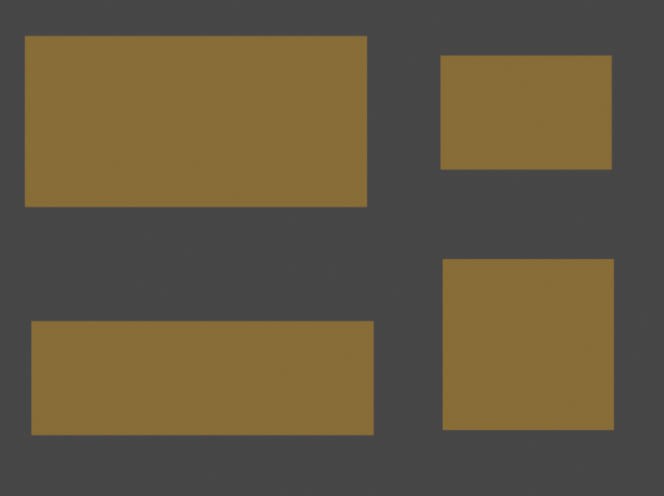

# 壁 床 屋根

### 内壁

| 名前 | 寸法(横 * 縦)m | 数量 | 材料 | 色 |
|---|----|---|---|--|
|側面の壁| 1.1 * 2.7| 4| ダンボール |白|
|奥の壁|2.0 * 2.7 |2 |ダンボール |白|
|床|2.0 * 2.2| 2 |ダンボール |白|
|屋根|1.7 * 1.1|2|ダンボール |白|
|屋根|2.2 * 1.1|2|ダンボール |白|
|奥装飾| 1.2 * 2.0| 2 | ダンボール |白|
|側装飾| 0.19 * 0.8| 4| ダンボール |白|

### 外壁

| 名前 | 寸法(横 * 縦)m | 数量 | 材料 | 色 |
|---|----|---|---|--|
|北|2.4 * 2.0|2|ダンボール|ロシアンブルー|
|装飾|2.2 * 1.3|2|ダンボール|ロシアンブルー|
|円|直径0.4m|2|ダンボール|ロシアンブルー|
|西1|0.6 * 4.0|2|ダンボール|ロシアンブルー|
|西2|4.0 * 0.75|1|ダンボール|ロシアンブルー|
|西3|0.75 * 1.9|1|ダンボール|ロシアンブルー|
|西4|4 * 0.2|1|ダンボール|ロシアンブルー|
|屋根1|2.3 * 1.1|2|ダンボール|ロシアンブルー|
|屋根2|2.3 * 1.2|2|ダンボール|ロシアンブルー|

### その他の壁

| 名前 | 寸法(横 * 縦)m | 数量 | 材料 | 色 |
|---|----|---|---|--|
|余りの屋根1|1.8 * 2|2|ダンボール|ロシアンブルー|
|余りの屋根2|0.9 * 0.4|1|ダンボール|ロシアンブルー|
|コンセント部分1|2.2 * 0.75|1|ダンボール|ロシアンブルー|
|コンセント部分2|2.2 * 0.4|1|ダンボール|土|
|機械床|1.1 * 1.0|4|ダンボール|ロシアンブルー|
|機械壁|1.1 * 3.2|2|ダンボール|白|

### 機械壁ベニヤ

| 名前 | 寸法(横 * 縦)m | 数量 | 材料 | 色 |
|---|----|---|---|--|
|壁|1.8 * 0.9|4| ベニヤ板||

### 後ろ壁

| 名前 | 寸法(横 * 縦)m | 数量 | 材料 | 色 |
|---|----|---|---|--|
|パネル1|1.8 * 0.6|3|ダンボール|クリーム色|
|パネル2|0.9 * 0.6|1|ダンボール|クリーム色|
|パネル3|0.9 * 0.9|1|ダンボール|クリーム色|
|パネル4|1.8 * 0.9|2|ベニヤ板|クリーム色|