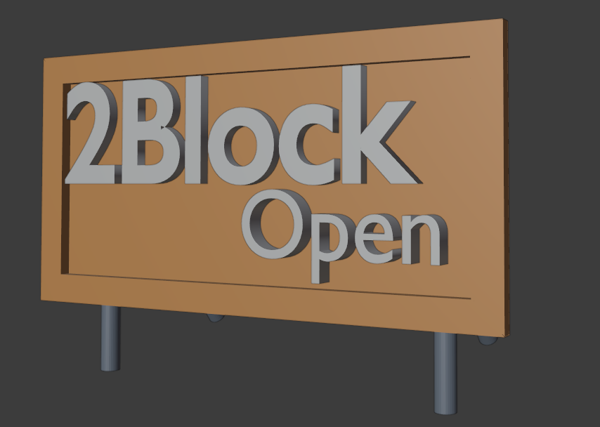
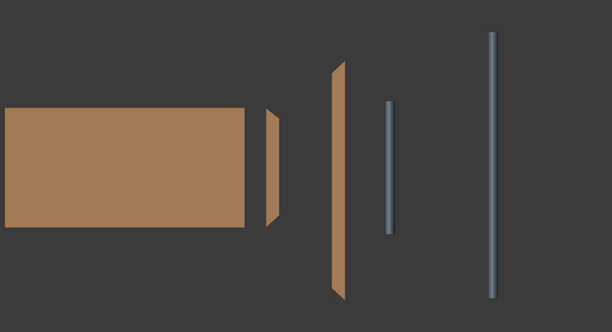

# 看板
## 完成イメージ

## 材料

- ベニヤ板
- 角材
- ダンボール
- ウッドペイント(ブラウン)
- ペンキ(茶色)
- ボンド
- 結束バンド
- セロハンテープ
- 塩ビパイプ
- クランプ

| パーツ|寸法|数量|
|-|-|-|
|塩ビ|1.0m|4|
|塩ビ|1.5m|2|
|直行クランプ|　|4|
|自在クランプ|　|2|

## パーツ
1. ベニヤ板、木材をウッドペイントで塗る
2. ベニヤに文字を書く
3. 塩ビに茶色で塗ったダンボールを巻く
4. 塩ビを組み立てて、ベニヤ板を結束バンドで固定する
5. 木材の角を切断
6. ベニヤ板に木材をボンドで固定